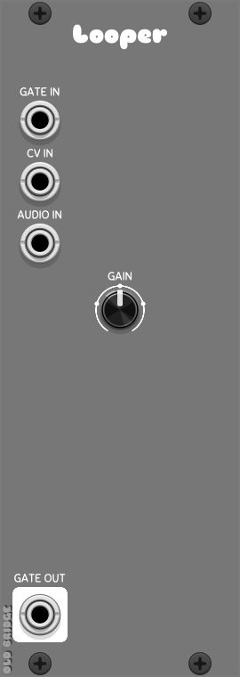
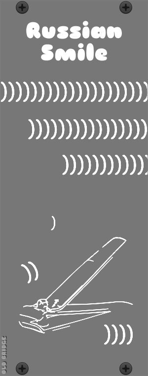

# Old Bridge

A small collection of VCV Rack 2 modules.

## Modules

### Filter

[](docs/screen_filter.png)

An FFT-based spectral filter. The input is transformed into the frequency domain, a
per-bin gain curve (one of seven filter types plus smoothing) is applied, and the
result is transformed back. The display always shows the input (red) and output
(green) spectra, yellow where they coincide, the active gain curve (cyan) and the
V clip level (magenta).

### Random Function Delay Trigger

[](docs/screen_randomfunctiondelaytrigger.png)

A clock-driven trigger/gate generator. On every step it picks a random delay from a
range shaped by two MIN/MAX constraint curves, then fires a trigger after that delay.
A polyphonic gate input produces delayed gates in the same fashion.

### Looper

[](docs/screen_looper.png)

A minimalistic looper with clock and reset inputs, audio in, gate and CV inputs,
start/stop triggers, a gain knob and a gate output.

### Smile

[](docs/screen_smile.png)

A simple blank panel.

## Install VCV Rack v2

https://vcvrack.com/Rack#get

## Install the VCV Rack SDK

https://vcvrack.com/manual/PluginDevelopmentTutorial

https://vcvrack.com/manual/Building#Building-Rack-plugins

## Build

```
export RACK_DIR=<Rack SDK folder>
make -C OldBridge
make -C OldBridge install
```
