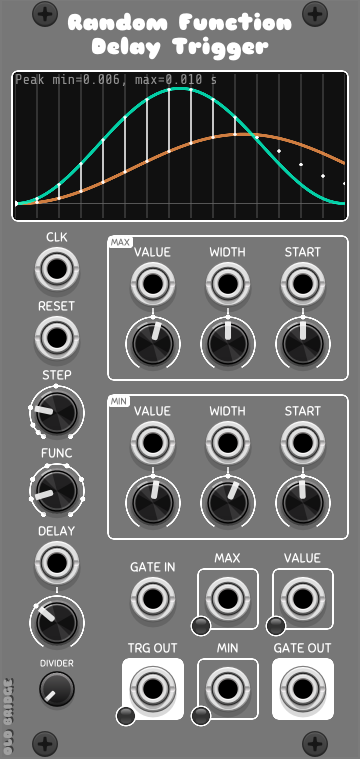

# Random Function Delay Trigger

A trigger/gate generator with a clock-driven sequencer of randomized delay values. On every clock step the module picks a new random delay (in seconds) from a range shaped by two "constraint" curves (MIN and MAX), then fires a trigger after that delay. A separate polyphonic gate input produces delayed gate outputs in the same fashion.

## Inputs

| Jack   | Name       | Description                                                    |
|--------|------------|----------------------------------------------------------------|
| CLK    | Clock in   | Step clock. A rising edge advances the step sequencer.          |
| RESET  | Reset in   | Rising edge resets the step counter to the first step.          |
| GATE IN| Gate in    | Polyphonic (up to 16 channels). Each rising edge schedules a delayed gate pulse. |
| VALUE  | Max value  | Scales the MAX curve amplitude.                                |
| WIDTH  | Max width  | Scales the MAX curve width/period parameter.                   |
| START  | Max start  | Shifts the MAX curve phase.                                    |
| VALUE  | Min value  | Scales the MIN curve amplitude.                                |
| WIDTH  | Min width  | Scales the MIN curve width/period parameter.                   |
| START  | Min start  | Shifts the MIN curve phase.                                    |
| DELAY  | Delay in   | Scales the base delay offset for both curves.                  |

## Params

| Knob     | Range     | Default | Description                                                                  |
|----------|-----------|---------|------------------------------------------------------------------------------|
| STEP     | 1..64     | 8       | Number of sequencer steps (snapped). The step curve spans 0..1 across steps. |
| FUNC     | 1..8      | 1       | Constraint function shaping the MIN/MAX curves (snapped).                    |
| DELAY    | -0.5..1.0 | 0       | Base delay added to both MIN and MAX values (seconds, x0.1 scaling).         |
| DIVIDER  | 1..128    | 1       | Clock divider. A step is taken every N clock edges (snapped trimpot).        |
| MAX / MIN group (each)                                                                                                            |
| VALUE    | -1..1     | 0.1     | Amplitude of the constraint curve (x0.1 scaling).                            |
| WIDTH    | -1..1     | 0       | Width/period of the constraint curve.                                        |
| START    | -1..1     | 0       | Phase offset of the constraint curve (wraps at 1.0).                         |

## Outputs

| Jack    | Name    | Description                                                                              |
|---------|---------|------------------------------------------------------------------------------------------|
| TRG OUT | Step out | 1 ms pulse fired at the end of the computed delay for the current step (green LED on pulse, red LED when a pulse is pending/fallback). |
| MAX     | Max out | Current MAX constraint value (10 V x seconds). Lights red when negative.                |
| MIN     | Min out | Current MIN constraint value (10 V x seconds). Lights red when negative.                |
| VALUE   | Value out | Current random delay value between MIN and MAX (10 V x seconds). Lights red when negative. |
| GATE OUT| Gate out | Polyphonic delayed gate pulses (up to 16 channels), 1 ms per trigger.                  |

## Display

The graph shows the MIN (orange) and MAX (cyan) constraint curves across the phase span,
vertical bars per step, a highlight on the current step, and the peak MIN/MAX values in seconds.

## How it works

1. Each clock edge advances an internal divider; every `DIVIDER` edges advances the step
   counter (wrapping at `STEP` steps). The current phase is `(step + divstep)/(steps-1)`.
2. The MIN and MAX curves are evaluated with the `FUNC` constraint function at that phase,
   using their own VALUE / WIDTH / START parameters (with optional CV scaling).
   A `DELAY` offset is added to both.
3. The delay value is picked uniformly between MIN and MAX; if the range is inverted
   (MAX < MIN) the midpoint is used instead.
4. On each step a delay timer is armed with that value; when it elapses a 1 ms trigger
   fires. If a new step arrives while the previous delay is still pending, the pending
   pulse is fired immediately (fallback for delays longer than the step time).
5. The GATE IN path works the same way independently per polyphony channel, scheduling
   a gate pulse after a freshly randomized delay.

## Constraint functions (FUNC)

| # | Curve                                   |
|---|-----------------------------------------|
| 1 | Gaussian bump (bell)                    |
| 2 | Rising/falling cosine shape             |
| 3 | Cosine wave with phase offset           |
| 4 | Triangle RAMP (note: uses phase-based ramp) |
| 5 | Constant VALUE                          |
| 6 | Constant WIDTH                          |
| 7 | Constant START                          |
| 8 | Linear ramp of the phase               |

## Scaling notes

- Knob values pass through a `x0.1` factor, so a knob at 1.0 produces a 0.1 s delay
  per unit of curve amplitude.
- CV inputs further scale the corresponding knob value by `0.1 x input voltage`.
- All output values are multiplied by 10 V, e.g. 0.1 s -> 1 V out.
- The display buffer is refreshed every 256 samples, so the graph may lag slightly.

## Known issues / TODO

See `TODO.md` (module name `RandomFunctionDelayTrigger`):
- func #4 (RAMP) writes to the member `current_min` instead of a local and uses the
  stale `current` variable.
- UI reads module state directly on the UI thread (display/module race).
- Duplicated param-read logic between `processTriggers()` and `updateViewBuffer()`.
